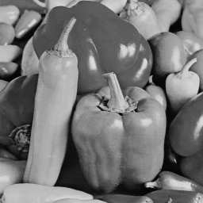
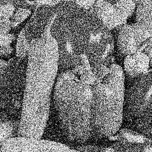

<strong>This repository is under construction.</strong>

# Adaptive-Block-Sparse-Regularization-under-Arbitrary-Linear-Transform

Julia code to implement LOP-l2/l1ALT proposed in the paper "Adaptive Block Sparse Regularization under Arbitrary Linear Transform".

## How to use

1. Clone the repository and change to the directory
2. Add the required packages to run `main.jl`
3. Run `main.jl`

## Demo results

### Denoise a grayscale image (Peppers)

This result is obtained by running `main.jl` with the default parameters set in `params.toml` ($\lambda = 0.15$, $\alpha = 1000$).

<table>
  <tr>
    <td>True image</td>
    <td>Noisy image (5 dB)</td>
    <td>Recovered image (18.59 dB)</td>
  </tr>
  <tr>
    <td></td>
    <td></td>
    <td></td>
  </tr>
</table>
